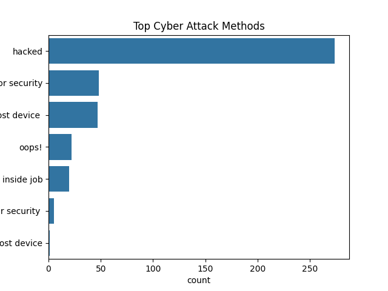
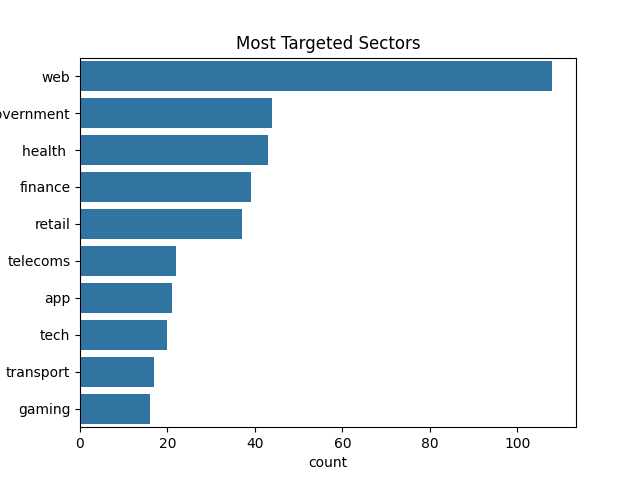
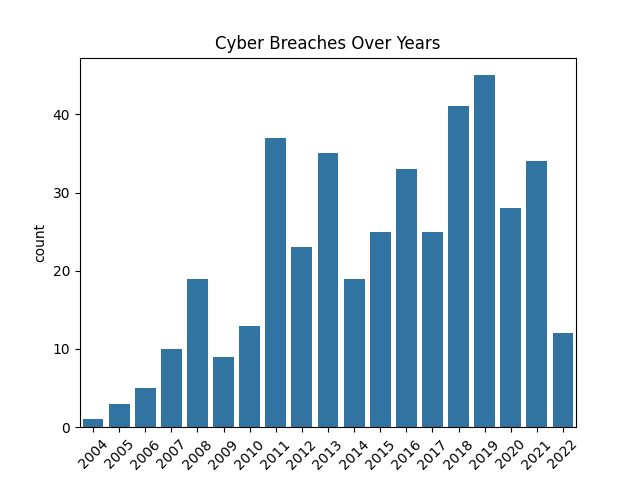

# Cybersecurity-Breach-Dataset-Analysis
This is my 2nd project 

## Overview
This project analyzes a real-world cybersecurity breach dataset to identify attack patterns, industry risks, and trends over time.

## Tools Used
- Python
- Pandas
- Matplotlib
- Seaborn

## Key Insights
- Most common attack method: Hacking
- Highly targeted sectors: Web, Government, Healthcare, Finance
- Increase in breaches observed after 2011
- Majority of breaches involve low to medium sensitivity data

## Visualizations
The project includes visual dashboards:
- Attack Methods Distribution
- Sector-wise Breaches
- Yearly Trends
## Visual Outputs

### Attack Methods

### Sector Analysis

### Yearly Trends

## Project Structure
- analysis.py → main analysis code
- databreachproject.csv → dataset
- *.png → generated graphs

## Outcome
Built a data-driven understanding of cybersecurity risks and presented insights through visualizations for better decision-making.
